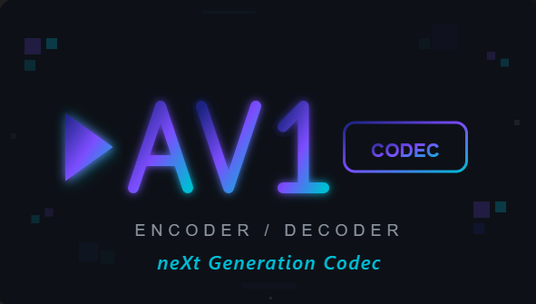

# AV1 Video Encoder Pro

A professional-grade GUI application for encoding videos to AV1 format using FFmpeg and SVT-AV1.



## Features

### 🎬 Video Encoder Tab

- **Input Selection** - Browse or drag & drop video files
- **Output Format** - WebM (recommended for web) or MP4
- **Quality Slider** - Visual slider showing quality % and CRF value (0-63)
- **Speed Presets** - 0 (slowest/best) to 13 (fastest)
- **Audio Options**:
  - Copy (keep original)
  - Opus 128k/192k/320k (recommended)
  - AAC 128k/192k/320k
  - No Audio
- **Resolution Scaling** - Original, 4K, 1080p, 720p, 480p
- **Tuning Modes** - VQ (Visual Quality), PSNR, SSIM, Film
- **Film Grain** - Add synthetic film grain (0-50)
- **Output Console** - Real-time encoding progress and logs
- **Encode/Cancel** - Start encoding or cancel in progress

### 📁 Batch Processing Tab

- **File List** - View queued videos for batch encoding
- **Add Folder** - Browse to add all videos from a folder
- **Drag & Drop** - Drop folders directly onto the list
- **Save to Folder** - Set custom output directory (or use source folder)
- **Schedule Encoding** - Toggle to enable scheduled batch encoding
- **Schedule Time Display** - Shows scheduled time when enabled
- **Start Batch / Schedule** - Process immediately or schedule for later
- **Clear** - Remove all files from queue
- **Supported Formats** - MP4, MKV, AVI, MOV, WebM, WMV, FLV

### ⏰ Scheduler Tab

- **Date Selection** - Today or Tomorrow
- **Time Selection** - Hour (HH) and Minute (MM) in 24-hour format
- **Integration** - Enable "Schedule Encoding" in Batch Processing tab to use

### ⚙️ Settings Tab

#### AV1 Encoder Selection

| Encoder | Type | Requirements | Status |
|---------|------|--------------|--------|
| **SVT-AV1** | CPU | Any CPU | ✅ Recommended |
| **libaom** | CPU | Any CPU | ✅ Works (very slow) |
| **rav1e** | CPU | Any CPU | ✅ Works |
| **NVENC** | GPU | NVIDIA RTX 40 series | ⚠️ Hardware required |
| **AMF** | GPU | AMD RX 7000 series | ⚠️ Hardware required |
| **QSV** | GPU | Intel Arc GPU | ⚠️ Hardware required |
| **Vulkan** | GPU | Vulkan AV1-capable GPU | ⚠️ Hardware required |

> **Note:** GPU encoders require specific hardware. If encoding fails with a GPU encoder, switch to SVT-AV1 (CPU) in Settings.

#### CPU Threading

- **Thread Slider** - Auto (0) to max CPU threads
- **Auto Mode** - Uses all available CPU cores
- **Manual** - Lower values reduce CPU usage

### ℹ️ About Tab

- **Version** - 1.1.0
- **Application Info** - Credits and links
- **GitHub Link** - Opens project repository

## Requirements

### For Running the Executable

- **Windows 10/11**
- **FFmpeg** (bundled with the exe)

### For Running from Source

- **Python 3.8+**
- **FFmpeg** with libsvtav1 support
- **Dependencies**: `pip install customtkinter pillow windnd`

## Installation

### Using the Executable

1. Download `AV1_Encoder_Pro.exe`
2. Run (FFmpeg is bundled)

### From Source

```bash
pip install customtkinter pillow windnd
python av1_encoder_ctk.py
```

### Using Docker

Docker provides a cross-platform way to run the encoder without installing dependencies.

#### Quick Start

```bash
# Build the image
docker build -t av1-encoder-pro .

# Or use docker-compose
docker-compose build
```

#### Web UI (Recommended for Docker)

Access the encoder via your web browser:

```bash
docker-compose up web
```

Then open **http://localhost:2081** in your browser.

Features:
- Upload videos directly in browser
- Configure all encoding settings
- Download encoded files
- Works on **Windows, macOS, and Linux**

#### CLI Mode

Encode a single video:

```bash
docker run -v $(pwd)/videos:/videos -v $(pwd)/output:/output av1-encoder-pro \
    -i /videos/input.mp4 -o /output/output.webm -q 50 -p 6
```

#### Batch Mode

Encode all videos in a folder:

```bash
docker-compose run batch
```

> See [DOCKER.md](DOCKER.md) for full Docker documentation.

## Usage Guide

### Single Video Encoding

1. Open **Video Encoder** tab
2. Click **Browse** or drag & drop a video
3. Set output format (WebM or MP4)
4. Adjust **Quality** slider (50% / CRF 30 recommended)
5. Choose **Speed Preset** (6 is balanced)
6. Click **Encode Video**
7. Monitor progress in **Output Console**

### Batch Encoding

1. Open **Batch Processing** tab
2. Click **Add Folder** or drag & drop a folder
3. Set **Save to Folder** if needed
4. Click **Start Batch**

### Scheduled Encoding

1. Open **Scheduler** tab
2. Set **When** (Today/Tomorrow) and **Time** (HH:MM)
3. Open **Batch Processing** tab
4. Add files to encode
5. Enable **Schedule Encoding** toggle
6. Click **Schedule** button
7. App will start encoding at the scheduled time

## Quality Guidelines

| CRF | Quality | File Size | Use Case |
|-----|---------|-----------|----------|
| 18-23 | High | Large | Archival, professional |
| 24-30 | Good | Medium | General use (recommended) |
| 31-40 | Medium | Small | Web streaming |
| 41-63 | Low | Very small | Bandwidth-limited |

## Speed Presets

| Preset | Speed | Quality | Use Case |
|--------|-------|---------|----------|
| 0-2 | Very slow | Best | Final renders |
| 4-6 | Balanced | Great | Recommended |
| 8-10 | Fast | Good | Quick previews |
| 12-13 | Very fast | Lower | Testing |

## Known Issues

1. **GPU Encoders** - Require specific hardware (RTX 40, RX 7000, Intel Arc)
2. **Vulkan Encoder** - May fail on systems without Vulkan AV1 support
3. **Large Files** - Very long videos may take extended time

## Building from Source

```bash
pyinstaller av1_encoder_ctk.spec --noconfirm
```

Output: `dist/AV1_Encoder_Pro.exe`

## Project Structure

```
├── av1_encoder_ctk.py      # Main GUI application
├── encode_cli.py           # CLI encoder for Docker/scripts
├── web_ui.py               # Web UI (Gradio) for Docker
├── av1_encoder_ctk.spec    # PyInstaller config
├── version_info.txt        # EXE version metadata
├── ffmpeg.exe              # FFmpeg binary (Windows)
├── requirements.txt        # Python dependencies
├── Dockerfile              # Docker image config
├── docker-compose.yml      # Docker services (web, cli, batch)
├── DOCKER.md               # Docker usage guide
├── assets/
│   ├── av1_codec_logo.png
│   └── CustomTkinter_icon_Windows.ico
├── dist/
│   └── AV1_Encoder_Pro.exe  # Built executable
├── README.md
└── USAGE_GUIDE.md
```

## Credits

- **FFmpeg** - Video encoding engine
- **SVT-AV1** - AV1 encoder by Intel/Netflix
- **CustomTkinter** - Modern Python GUI toolkit
- **windnd** - Windows drag & drop support

## License

© 2025 AV1 Encoder Pro. All rights reserved.
